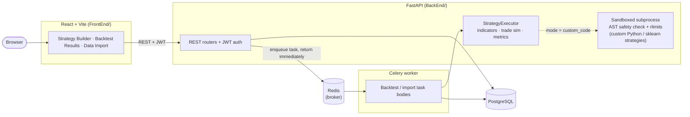
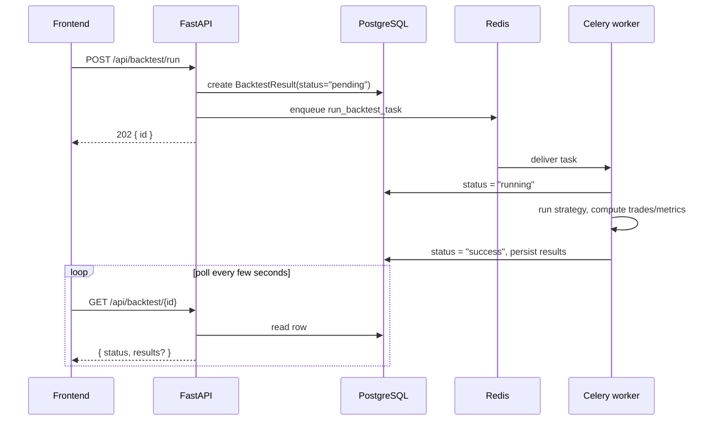

# QuantTrade

[](https://github.com/krishnara1201/quanttrade/actions/workflows/ci.yml)
[](#license)

A full-stack trading strategy backtesting platform. Define a strategy visually (indicators + entry/exit rules) or as sandboxed custom Python — including scikit-learn models — then backtest it against real market data as a single ticker, a weighted multi-ticker portfolio, or a walk-forward out-of-sample evaluation. Long/short, stop-loss/take-profit, and a buy-and-hold benchmark overlay are built in. Backtests run asynchronously on a Celery worker so the API never blocks on a multi-minute run.

**Stack:** React + Vite frontend, FastAPI + SQLAlchemy (async) backend, PostgreSQL, Redis/Celery for async task execution, Alembic for migrations.

## Why this project

This started as a backtesting CRUD app but the interesting engineering is in a few specific places:

- **Sandboxed arbitrary-code execution.** Custom strategies run untrusted user Python (with `pandas`/`numpy`/a curated `scikit-learn` allowlist) in a separate subprocess with `RLIMIT_AS`/`RLIMIT_CPU` wall-clock and memory limits, AST-level import/builtin restrictions checked both at save time and again at runtime, and no untrusted data crossing the process boundary via `pickle`. See [`services/sandbox_executor.py`](BackEnd/services/sandbox_executor.py).
- **Async task architecture with no result backend.** Backtests/imports enqueue onto Celery/Redis and return immediately; the worker writes status directly onto the row it was enqueued for (`pending → running → success/failed`) instead of relying on Celery's result store, so the frontend polls the resource itself. See [`tasks.py`](BackEnd/tasks.py) and the "Async task execution" section of [`CLAUDE.md`](CLAUDE.md).
- **Walk-forward evaluation to catch look-ahead bias.** A single ordinary backtest fits a model on the whole date range before "predicting" over it — walk-forward mode instead re-runs signal generation per expanding fold and stitches only the out-of-sample results into one compounding equity curve. See [`services/walk_forward_service.py`](BackEnd/services/walk_forward_service.py).
- **Dialect-sensitivity discipline in testing.** The test suite runs against in-memory SQLite for speed, but several real bugs (raw date strings passed to Postgres/asyncpg, `asyncpg` connections leaking across event loops in forked Celery workers) only ever showed up against real Postgres. Fixes for those are regression-tested by asserting on SQLAlchemy's *compiled bind types*, not by requiring Postgres in CI — see the "SQLite tests can hide Postgres-only bugs" note in `CLAUDE.md`.

## Architecture



A backtest run never blocks the request thread — the API creates a `pending` row, enqueues a task, and returns; the frontend polls the row for status. No Celery result backend is used, so status/errors live on the domain row itself, not in Celery's own store:



## Features

**Strategy definition**
- Visual rule builder: SMA, EMA, RSI, Bollinger Bands, MACD, combined via whitelisted comparison expressions (`"fast_ma > slow_ma"`) parsed without `eval`/`exec`
- Custom Python signal code (`generate_signals(df) -> pd.Series`), including scikit-learn models (`linear_model`, `ensemble`, `tree`, `svm`, `naive_bayes`, `neighbors`, `preprocessing`, `pipeline`, `model_selection`, `metrics`), run inside the sandbox described above

**Backtesting**
- Single-ticker, portfolio (weighted multi-ticker basket, independently simulated and aggregated), and walk-forward (expanding train window, rolling out-of-sample test windows, capital compounding across folds) modes
- Long and short positions, configurable commission/slippage, optional stop-loss/take-profit
- Buy-and-hold benchmark overlay on every result type
- Sharpe ratio, max drawdown, win rate, and equity-curve/trade-level detail persisted per run

**Data**
- Bulk market data import via CSV/TXT upload (header'd or headerless Stooq-style multi-symbol exports) or the Alpha Vantage API
- Ticker/date-range discovery endpoints that drive the frontend's date pickers, so a backtest can't be submitted against a range with no data

**Platform**
- JWT auth, ownership checks walked through the full `User → Project → Strategy → BacktestResult` relationship chain
- Async execution via Celery + Redis for every long-running operation (backtests, portfolio/walk-forward runs, CSV/API imports)
- Schema managed via Alembic migrations (no ad hoc `create_all`)
- Fully Dockerized (Postgres, Redis, backend, worker, frontend) with hot reload in dev

## Testing

```bash
cd BackEnd && uv run pytest tests/ -v       # 163 tests
cd FrontEnd && npm run test                 # 17 tests
```

- **Backend:** real execution throughout, no mocks — an in-memory `sqlite+aiosqlite` engine for ownership/async-task regressions, real sandboxed subprocess execution for custom-code strategies (including an end-to-end scikit-learn fit+predict across multiple walk-forward folds), and Celery's `task_always_eager` mode instead of a real broker. Dialect-sensitive fixes (Postgres vs. SQLite) are hand-verified against a live `docker compose up` Postgres instance in addition to the SQLite-backed suite.
- **Frontend:** Vitest + React Testing Library, covering the areas with the most non-obvious logic — the JWT auth-header attach-before-child-effects ordering fix, the async polling loop's timeout behavior, and route-level auth gating.
- **CI:** GitHub Actions runs both suites plus a production frontend build on every push/PR to `main`.

## Getting Started

### 🚨 Security Setup (do this first)

**Never use the example secret key in production.** Generate one:
```bash
python -c "import secrets; print(secrets.token_urlsafe(32))"
# or: openssl rand -hex 32
```

Then copy the env template and set it:
```bash
cd BackEnd
cp .env.example .env
# edit .env and replace SECRET_KEY with your generated key
```
`.env` is already gitignored — never commit secrets, and use `.env.example` as a template only.

### 🐳 Docker (recommended)

Runs the full stack — Postgres, Redis, backend, worker, and frontend — with no local Python/Node/Postgres/Redis install needed.

```bash
cp BackEnd/.env.example BackEnd/.env
# edit BackEnd/.env and set SECRET_KEY (see above)
docker compose up
```

- Backend: http://localhost:8000
- Frontend: http://localhost:5173
- Postgres: localhost:5432 (`postgres`/`postgres`/`quanttrade`)
- Redis: internal broker for the `worker` service, not exposed on a host port

`backend`/`frontend` hot-reload on file changes. **`worker` does not** — Celery has no autoreload wired up here, so restart it after backend changes: `docker compose restart worker`.

Both `backend` and `worker` run `alembic upgrade head` on container start, so a fresh `docker compose up` always lands on an up-to-date schema. Rebuild after dependency changes: `docker compose up --build` (add `--renew-anon-volumes` if the frontend's `node_modules` changed).

### Manual (without Docker)

```bash
# Backend — requires uv (https://docs.astral.sh/uv/)
cd BackEnd
uv sync
uv run alembic upgrade head
uv run uvicorn app:app --reload
```

```bash
# Frontend
cd FrontEnd
npm install
npm run dev
```

## Security

- bcrypt password hashing, JWT auth
- CORS configured via `CORS_ORIGINS`
- SQL injection prevention via the SQLAlchemy ORM throughout
- Strategy condition parsing is regex-whitelisted, never `eval`/`exec`
- Custom-code strategies run in a resource-limited subprocess with AST-level import/builtin restrictions (see "Why this project" above) — network isolation is *not* provided (no containers/seccomp), which is documented as an accepted tradeoff for personal/small-scale use, not multi-tenant SaaS
- Ownership verification on every mutation, walked through the full relationship chain rather than a denormalized owner field

## Tech Stack

**Backend:** FastAPI · SQLAlchemy (async) · PostgreSQL · Alembic · Celery + Redis · pandas/numpy · scikit-learn · python-jose · pytest

**Frontend:** React 18 · React Router · Axios · Recharts · CodeMirror (custom-code editor) · Vite · Vitest + React Testing Library

## License

MIT
